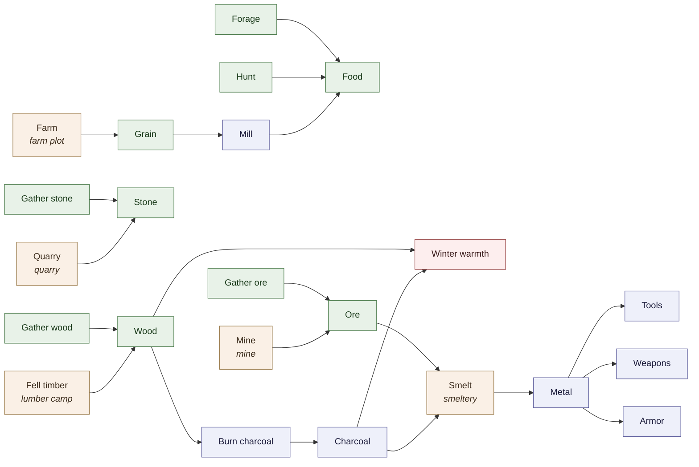
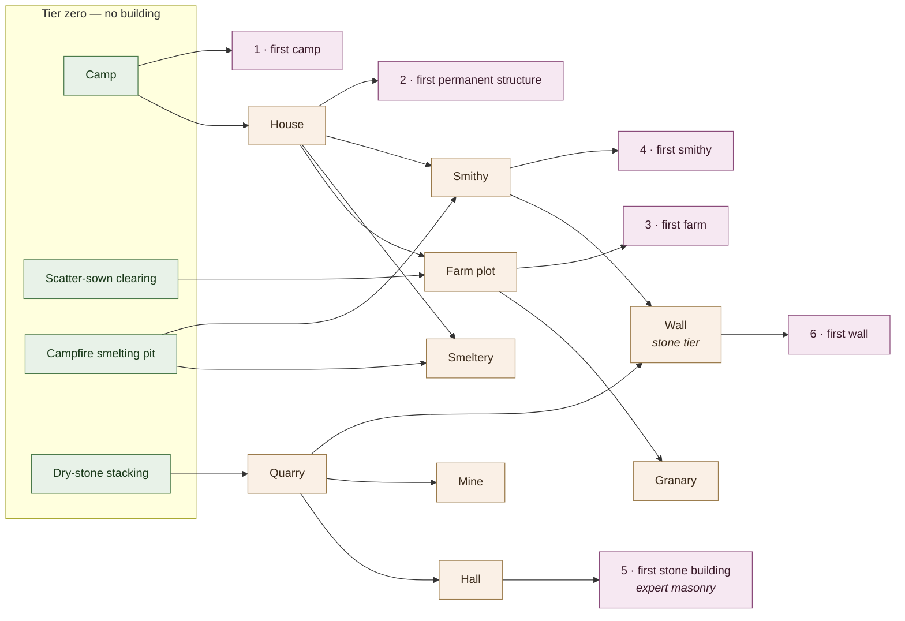

# Kingdom Watch — The Economy Ladder

The contents of the economy: what the resources are, what chains connect them,
which jobs and buildings exist, and what the six progression milestones
actually mean as conditions the simulation can test.

The [design plan](kingdom-watch-plan-v7.1.md) §9 explains *why* the economy is
shaped this way — a capability graph rather than a tech tree, skill tiers to
resolve the smithing chicken-and-egg. This document is the *what*. It exists
because §9 committed to "~10 resources with two-step chains" and to five gates
on every building without ever naming a resource, a building or a milestone
condition, which left #22, #23, #26, #37 and #53 each inventing the piece they
needed (#78).

**This is a map, not a schema.** Nothing here is implemented. `ResourceKind`,
`JobKind`, `Recipe` and `PrimitiveTier` are untouched by the change that added
this file, and the M1 slice — Food, Wood, Stone, gathering only — stands as
#52 built it.

**Seven resources, not ten.** §9 estimates "~10" — seven is what earns a
place on its own merits below, not a target to fill. §9's "~10" is corrected
to match.

> **Table order is presentational.** `ResourceKind` and `JobKind` are
> append-only and persisted, and the order in which the values below are
> *appended* is deliberately not decided here — that belongs to the issue
> doing the appending (#22 for jobs, #37 for resources). Read the rows as a
> set. The values that already exist carry their real numbers, and those are
> permanent.

---

## 1. Resources

Seven kinds. Three exist; four are named here and appended by later issues.

**Depth** is how many craft steps separate a kind from the world: a gathered
kind is depth 0, and a crafted kind is one more than its shallowest input.
§9's "two-step chains" is the rule that nothing exceeds depth 2, which keeps
the graph inspectable and the deadlock surface small.

| Resource | Enum | Depth | Source | Notes |
|---|---|---|---|---|
| Food | `ResourceKind.Food = 1` | 0 | Foraged, hunted, or milled from Grain | No spoilage (§5 below). The only kind anyone dies without. |
| Wood | `ResourceKind.Wood = 2` | 0 | Gathered deadfall, later felled at a lumber camp | Also winter fuel — see §2. |
| Stone | `ResourceKind.Stone = 3` | 0 | Loose surface stone, later quarried | |
| Grain | *appended later* | 0 | Harvested from a farm plot | A much higher yield per worker than Forage or Hunt — the thing that lets a settled population outgrow a foraging one. Milled into Food; no spoilage of its own. |
| Ore | *appended later* | 0 | Surface nodules and bog iron, later mined | |
| Charcoal | *appended later* | 1 | Wood, burnt in a pit | The efficient fuel — see §2. No building raises its yield; a pit is a pit. |
| Metal | *appended later* | 2 | Ore + Charcoal, smelted | §9's `iron_tools` chain. Feeds Tools, Weapons and Armor (§6). |

### Chains

| Recipe | Inputs | Outputs | Needs | Substitutes |
|---|---|---|---|---|
| Forage | — | Food | — | Hunt, Mill |
| Hunt | — | Food | — | Forage, Mill |
| Mill | Grain | Food | — | Forage, Hunt |
| Gather wood | — | Wood | — | — |
| Fell timber | — | Wood | lumber camp | Gather wood |
| Gather stone | — | Stone | — | — |
| Quarry | — | Stone | quarry | Gather stone |
| Gather ore | — | Ore | — | — |
| Mine | — | Ore | mine | Gather ore |
| Farm | — | Grain | farm plot | — |
| Burn charcoal | Wood | Charcoal | — | (see §2 — Wood substitutes for *heating*, never for smelting) |
| Smelt | Ore, Charcoal | Metal | smeltery | — |

Three of these are what `PrimitiveTier` already ships — Forage, Gather wood,
Gather stone — with their placeholder quantities and durations unchanged.

**No `degrades_to` column.** §6 below settles that Weapons, Armor and Tools
have no per-item quality at all, so there is nothing for an individual item
to degrade *to* — and no fallback recipe is needed either, because nothing
requires one in the first place. Every job already runs at a real,
functioning rate with zero tools, the same way Forage and Gather wood run
with zero inputs; a Tool is a bonus on top of that baseline, never a
precondition for it.

### The rule that keeps it from deadlocking

§9 requires every recipe to have a substitution list, and a harness test of
200 years with no settlement ever deadlocking. The property that makes that
test passable is stated here so later additions can be checked against it:

> **No survival-critical resource has a single source, and no single-source
> resource is survival-critical.**

Food has three independent sources and two of them need no building, so a
settlement that loses its farm forages or hunts instead.

Four kinds have a single source — Wood, Grain, Charcoal and Metal — and none
of them is survival-critical:

- **Grain** exists only to become Food, which Forage and Hunt also supply
  directly. Losing farmland costs population capacity, not survival.
- **Charcoal** has one source (Burn charcoal) and no substitute for smelting,
  but Wood substitutes for its other use, heating (§2) — its one essential,
  unsubstitutable role isn't one anything's survival depends on.
- **Metal** improves how fast a smithy re-equips people (§6); nobody needs a
  Tool, Weapon or Armor to work a job or to fight (§6, §8) — without Metal, a
  settlement runs at the untooled rate every job already has, not a blocked
  one.
- **Wood** is needed to build and to keep warm rather than to live outright.
  A band that can reach no forest stays nomadic and layers on extra clothing
  and body heat instead, which #54 already models as an ordinary outcome
  rather than a failure.

**No building is gated on a single-source resource that survival depends on
either**, which is the same rule one level up.

Adding an eighth resource means re-checking this list, not just adding a row.

---

## 2. Fuel and winter heating

Wood and Charcoal both burn for warmth. **Charcoal is the efficient fuel** —
it lasts substantially longer per unit than raw Wood — so there is a real
choice ahead of winter: burn Wood as it is gathered, or spend labour
converting some of it to Charcoal first for a much larger stored heat value
per unit of storage capacity (§5). Neither is required; both work.

This is *not* two independent fuel pools. Charcoal is Wood, one processing
step later, so a settlement that burns all its Wood into Charcoal for the
smeltery has exactly as little left to heat homes with as one that burned the
Wood directly — the finite resource is Wood itself, however it ends up being
spent. **Charcoal has no substitute for smelting** (Metal needs it
specifically, matching §9's `iron_tools` example), but for heating, Wood is a
straightforward if less efficient substitute — which is what keeps Charcoal
off the single-source-and-critical list in §1.

The mechanism reuses one already built: `Hunger` (`Core/Work/Hunger.cs`, #51)
schedules one `MealDue` event per food holder per day and draws Food from the
ledger. A `WarmthDue` event doing the same thing with Wood-or-Charcoal in
winter is the same shape, not a new one — and, like hunger, going without it
past a grace period costs health rather than killing outright, which is a
believable way for a hard winter to actually kill people.

---

## 3. Jobs by tier

A job is a standing role, not a recipe index — `JobKind`'s remark already
carves out the roles that are not recipes at all.

### Tier zero — no building

| Job | Enum | Runs |
|---|---|---|
| Forager | `JobKind.Forager = 1` | Forage |
| Woodcutter | `JobKind.Woodcutter = 2` | Gather wood |
| StoneGatherer | `JobKind.StoneGatherer = 3` | Gather stone |
| Hunter | *appended later* | Hunt |
| OreGatherer | *appended later* | Gather ore |

### Building-gated

| Job | Needs | Runs |
|---|---|---|
| Lumberjack | lumber camp | Fell timber |
| Quarrier | quarry | Quarry |
| Miner | mine | Mine |
| Farmer | farm plot | Farm |
| Smelter | smeltery | Smelt |
| Smith | smithy | Crafts Tools, Weapons and Armor from Metal (§6) |

### Not recipes at all

| Job | What it does |
|---|---|
| Builder | Turns hauled materials into a building. Consumes, produces nothing. |
| Hauler | Moves stock between site, store and workshop. |

Milling is deliberately not a job. A quern is tier-zero household work, so
Grain becomes Food without anyone holding a role for it.

**Soldiering is not a job either, and not in the tables above.** It is a
skill a person carries — §8 — engaged only during a muster or a direct
defense, layered on top of whatever standing job they hold the rest of the
time. A Farmer who fights off a raid does not stop being a Farmer.

---

## 4. Buildings

### Production and infrastructure

Each with §9's five gates: minimum relevant skill, necessary inputs,
prerequisite infrastructure, sufficient labour surplus, and actual settlement
demand. Labour surplus and demand are per-settlement conditions rather than
fixed numbers, so they are described rather than tabulated.

| Building | Min skill | Inputs | Prerequisite | Enables |
|---|---|---|---|---|
| Camp | — | Wood | — | Settling at all (#54) |
| House | Novice construction | Wood | a camp | Households with a real home (#69); tiers further as the settlement's demand grows, the same way the seat of government does below |
| Farm plot | Novice farming | Wood | cleared land, a house | Grain |
| Lumber camp | Apprentice woodcraft | Wood | forest in reach | Wood at rate |
| Quarry | Apprentice masonry | Wood | hills in reach | Stone at rate |
| Mine | Journeyman masonry | Wood | hills in reach, a quarry | Ore |
| Smeltery | Journeyman metalworking | Stone | a house | Metal, at rate |
| Smithy | Journeyman metalworking | Stone | a house | Tools, Weapons, Armor, forged from Metal |
| Hall | Expert masonry | Stone | a quarry | Where festivals and funerals happen (§12's outdoor social life); the first dressed-stone building |
| Palisade → Wall | Apprentice construction → Expert masonry | Wood, then Stone, Metal | a house, then also a quarry, a smithy | Basic perimeter defense from early on; the stone tier is the last milestone — see §4a |
| Wooden watchtower → Stone watchtower | Novice construction → Apprentice masonry | Wood, then Stone | a house, then also a quarry | Standing lookout — standalone from the wall, not a prerequisite for it |
| Town Hall → Fort → Castle | Apprentice → Journeyman → Expert construction | Wood, then Stone | — | One administrative slot, tiering as population and defensive need cross thresholds — see §4a. Not a building the player or an AI queues an upgrade for. |
| Marketplace | Apprentice construction | Wood | a house | Where the abstracted settlement-to-settlement trade edge (§12) attaches, and where social life happens outdoors (§12). No mechanics of its own. |
| Dock | Apprentice construction | Wood | water in reach | Boat launch and cross-water traversal (#45, M9). Whether it also fishes for Food is open — see §9. |

Masonry is the one capability that climbs the whole way: dry-stone stacking
at tier zero, a quarry at apprentice, a mine at journeyman, dressed stone —
the hall and the wall — at expert. **Buildings that merely contain stone do
not count as stone construction**, which is why the smeltery and the smithy
are gated on metalworking rather than masonry even though both take Stone as
an input. Without that distinction the "first stone building" milestone fires
on whichever building happens to list Stone among its inputs, which would put
it before the smithy and inverted against the ladder in §7.

**Smelting and smithing are gated on skill alone, and independently of each
other.** Charcoal burns in a pit and surface ore is gathered like surface
stone, so neither the smeltery nor a mine is a precondition for reaching
Journeyman metalworking — making either one a prerequisite would put the
whole metal branch behind journeyman masonry, which is the chicken-and-egg §9
exists to prevent, reintroduced one rung up. The same independence holds
between the two metalworking buildings themselves: the smithy does not
require a smeltery to exist first. It only needs Metal in stock, and crude
pit-smelting already supplies that — so a settlement can forge Tools before
it ever builds a dedicated smeltery, exactly as reachability requires. The
smeltery is a rate upgrade over the pit, the same relationship Quarry has to
Gather stone.

Placement preferences are §12's town planner (#23) and are not repeated here.
This table says which buildings exist and what gates them; #23 says where
they go.

#### 4a. Single slots that tier up, not a tech tree

Town Hall → Fort → Castle is a single building slot that **tiers up as the
settlement's own population and defensive need cross thresholds**, the same
gating already used for the smithy — skill, inputs, infrastructure, labour
surplus, demand. There is no player-driven or AI-queued "upgrade" button, and
no fixed resource cost that unlocks the next tier on its own. This keeps §9
and §20's "no research system, no explicit tech ladder" stance intact:
nothing here is a purchased or researched upgrade, it is infrastructure
responding to a settlement that has outgrown the last tier, exactly like a
granary responding to a farm that has outgrown storing surplus by hand.

Houses tier the same way, independently, per household rather than per
settlement.

**The wall and the watchtower tier the same way, across two capabilities
instead of one.** A settlement gets a Palisade and a wooden watchtower from
Construction alone, long before anyone reaches Expert masonry — closing what
would otherwise be a decades-long stretch (§9's pacing puts the stone Wall at
year 70–100) with no built defense at all beyond §8's "anyone can fight."
Reaching Expert masonry replaces the Palisade with a Wall, and Apprentice
masonry replaces the wooden watchtower with a stone one. The stone tier is
still what §9's milestone 6 fires on — a Palisade is infrastructure on the
way there, not an earlier version of the achievement, the same way a farm
plot existing doesn't bring forward "first stone building."

### Storage

A different shape from the buildings above: each one only **raises capacity**
for a bundle of resources or items (§5). None of them produce anything.

| Building | Min skill | Prerequisite | Raises capacity for |
|---|---|---|---|
| Granary | Apprentice construction | a farm plot | Food, Grain |
| Woodshed | Apprentice construction | a house | Wood, Charcoal |
| Stoneyard | Apprentice construction | a house | Stone, Ore |
| Vault | Journeyman construction | a smeltery or a smithy | Metal, Tools |
| Armory | Apprentice construction | a smithy | Weapons, Armor |

The bundling groups kinds by what they're storage *for*, not just by who
makes them: Granary and Woodshed hold what a household consumes, Stoneyard
holds bulk raw material. Vault and Armory split the metalworking chain's
output — smeltery and smithy together — along the line that actually
matters for planning — **martial versus everything else** — rather than by
which of the two buildings crafted it. Weapons and Armor are
issued to a small, temporary subset of the population during a muster (§8);
Tools are held continuously by a large share of it, in ordinary work. Sharing
one capacity pool between the two would mean a settlement thick with
Woodcutters' axes could crowd out its own ability to arm a muster, coupling
two things that have no reason to compete for the same shelf space.

Metal does not share the Stoneyard despite being mineral-derived — it is
stockpile capacity for the *precursor* the smeltery produces, a different
planning concern from raw ore reserves. It sits with Tools rather than with
Weapons and Armor for the same martial/non-martial line: Metal in the Vault
is potential of either kind, not yet committed to one.

---

## 5. Storage and capacity

Every resource and item kind has a capacity. A base amount is always free —
sitting, implicitly, at the Town Hall/Fort/Castle — and each storage building
in §4 raises it further for its bundle.

This generalizes something that already exists rather than inventing
something new: `Core/Work/Jobs.cs:148,151` has `WoodCap = 200` and
`StoneCap = 100` today — flat, per-band constants that tell a Woodcutter or
StoneGatherer to stop gathering once the band's expected stock would reach
them. That is a real cap, just an ad-hoc, unbuildable one covering two
resources. The system here replaces two special-cased numbers with one
principled rule covering every kind.

**Overflow: workers idle, nothing is wasted.** Exactly what `WoodCap` and
`StoneCap` already do — a worker stops gathering or crafting once the
settlement's expected stock of that kind would hit its capacity. Nobody's
work is lost; they simply stop early and (per §12's job-assignment loop) pick
up whatever else is needed instead.

**No spoilage, anywhere.** Capacity is the only supply-side constraint. Food
and Grain sit in stock exactly as gathered until eaten or the cap fills up;
nothing decays while it waits. This corrects §9's "storage is core —
granaries, stores, spoilage" line — spoilage turned out not to be the
mechanism worth building; capacity is.

The exact numbers — how much is free at the Town Hall, how much each storage
building adds — are not decided here. They are exactly the kind of thing
`PrimitiveTier`'s quantities already are: placeholders for the harness (#17)
to tune once there is a world to run them against.

---

## 6. Equipment: ownership and death

Tools, Weapons and Armor are all crafted at the Smithy from Metal, and all
draw on storage capacity split along martial lines (§4) — Tools in the Vault
alongside the Metal they're forged from, Weapons and Armor in the Armory.
**The settlement owns the underlying stock; a person equips an instance from
it** while they hold a job or a levy status that can use one — a Farmer's
plow, a Woodcutter's axe, a levied soldier's sword. None of the three is
required: every job and §8's levy both run at a real, working rate with
nobody equipped at all. An item is a bonus on top of that baseline, never a
precondition for it.

**No per-item quality.** Every Weapon, Armor piece or Tool of a given kind is
functionally identical, whoever made it. A smith's skill tier changes only
how fast the smithy can produce or replace them — throughput, not quality —
which is the same rule §7 states for every production capability. A master
smith's value is keeping more of the population equipped at once, not making
any one soldier individually stronger.

**Destroyed on death, uniformly — no inheritance.** Tools, Weapons and Armor
alike return to nothing when their holder dies; there is no transfer-to-
household step for any of the three. Leaving a job or a levy without dying is
different — the item returns to its storage building's stock normally (the
Vault for a Tool, the Armory for a Weapon or Armor piece), the same as any
other checked-out resource.

**This made §6 of the design plan wrong about tools specifically, and it has
been corrected in the same change.** It used to read, in the property
section: *"On death, personal wealth folds into the household. This gives
some wealth variation and makes a master's tools a real asset."* Tools are no
longer inherited, so they can no longer be that asset; general personal
wealth still folds into the household and still gives variation, tools just
aren't part of it. This settles #68's open question for tools specifically:
neither pure ledger stock nor freely inheritable property, they are
checked-out-while-in-use and gone at death.

**No fallback is needed when Metal is unreachable.** A settlement with no
reachable Ore is not without functioning jobs or a functioning levy — it is
simply without the rate bonus a Tool, Weapon or Armor gives on top of the
baseline every job and every fighter already has. Nothing degrades, because
nothing was required to begin with.

---

## 7. The capability graph

Eight capabilities, each with the five skill tiers of §9 —
Novice → Apprentice → Journeyman → Expert → Master — save one, noted below.

§9's binding constraint is that **every capability must have a reachable path
from primitive life**, or the chicken-and-egg simply moves one rung up. The
check is per-capability and mechanical: each one needs a crude form that
requires no building, so skill can be built before the building that skill
gates.

| Capability | Crude form at tier zero | What skill then unlocks |
|---|---|---|
| Foraging | Forage | — (no building form) |
| Hunting | Hunt | — |
| Woodcraft | Gather wood | Fell timber, at a lumber camp |
| Construction | Camp | House, then storage, administrative and wood-tier defensive buildings |
| Farming | Scatter-sown clearing | Farm plot |
| Masonry | Dry-stone stacking | Quarry and the stone watchtower at apprentice, mine at journeyman, hall and wall at expert |
| Metalworking | Ore smelted in a campfire pit | Smeltery and smithy, independently |
| Soldiering | Any untrained adult, weapon in hand | — (no building form, ever) |

A crude form runs the same chain as its building form, worse and slower, and
that is why only the building form appears in §1's chain table: a
scatter-sown clearing and a farm plot both yield Grain, a campfire pit and a
smeltery both yield Metal. The crude form is not a separate recipe to
balance, it is the same recipe without the building and at a penalty.

Metalworking is the case §9 works through: a novice works metal badly at a
pit, doing so builds skill, and at journeyman both a smeltery and a smithy
become viable — so the technology climb is paced by human learning time
rather than a timer, and varies per world because it depends on who happens
to be good at what.

**Every capability but one only ever affects rate, never quality** (§6). The
one exception is **Soldiering**, and it is not really an exception: the rule
was always about *production* — how fast something gets made. A person
fighting is not producing anything, so there is no rate for their own
performance to be measured in. Soldiering can only ever mean "how good," and
it grows the way metalworking's crude tier does — by doing, here meaning by
surviving fights — rather than through any building at all, which is also why
it needs no reachability check: it never required infrastructure to begin
with.

**Every row above has a tier-zero entry, so the graph is reachable.** A new
capability is not finished until it has one.

---

## 8. Combat and the levy

**Equipment is never a hard gate on fighting.** Any adult can be levied for a
muster or can join a direct defense — a raid, a predator, a siege — whether
or not they currently hold a Weapon or Armor. A settlement caught short-handed
still has its trapped citizens.

Two things vary how well that goes, and neither is the smith's skill:

- **Whether the person is equipped.** Real, but the exact effect on survival
  or combat odds is not decided here — it is #27/#28's threat-and-disruption
  system to design, once it exists to design against.
- **The person's own Soldiering tier** (§7) — a personal, quality-bearing
  trait distinct from crafting skill, grown by experience.

The smith's own skill tier is not one of the two. It governs how much of the
population can be kept equipped at all (§6), which is a settlement-level
readiness question, not an individual combat one.

---

## 9. The progression ladder

The design plan's §9 and §16 both name the same six milestones. Here they are as conditions the
simulation can test, with §16's OR-conditions where a strict single condition
could softlock a world.

| # | Milestone | Fires when |
|---|---|---|
| 1 | First camp | A band's settling trigger fires (#54) |
| 2 | First permanent structure | A house completes |
| 3 | First farm | A farm plot yields its first Grain |
| 4 | First smithy | A smithy completes, OR a Journeyman metalworker exists |
| 5 | First stone building | A building requiring expert masonry completes — normally the hall — OR an expert mason exists |
| 6 | First wall | A wall encloses a settlement, OR the settlement has stood a raid and an expert mason exists |

Milestones 4, 5 and 6 carry an OR because each can softlock: a world with no
reachable ore never builds a smithy or a wall, and a wholly peaceful world
never needs a wall at all. The alternate condition is in every case the
*capability* having been reached rather than the building existing, which is
what the milestone is really measuring — and it is what keeps an ore-less map
playable to the end of the ladder rather than stalling it at milestone 3.

### Target pacing

**These are placeholders, in the same sense as `PrimitiveTier`'s quantities
and durations: chosen to be plausible for the arc §1 of the design plan
describes, not tuned. Nothing here should be read as a balance decision.**

They exist because §15 calls time to first journeyman "a critical pacing
number" and says to tune it in the harness early, and until something states
a target there is nothing to tune toward. `Harness/` currently has only
`SchedulerSoak.cs` as a workload, so none of these has been measured — the
first world run is #17.

| Milestone | Target | Confirmed by |
|---|---|---|
| First camp | year 0–2 | #17's first chronicle |
| First permanent structure | year 3–5 | #17 |
| First farm | year 8–15 | #17, then #53 once seasons gate sowing |
| **First journeyman, any craft** | **year 20–30** | #22, the number §15 names |
| First smithy | year 30–40 | #22 |
| First stone building | year 50–70 | #23 |
| First wall | year 70–100 | #23 |

A full ladder in roughly a century, against the ~1,650-person equilibrium of
the design plan's §1 and the centuries it spans. The shape that matters more
than the numbers: the gap from farm to smithy is learning time, not
construction time, and the gap from smithy to wall is skill again. If tuning
collapses either gap, the capability climb has stopped being paced by people
and the pacing lever the design plan's §9 describes has been lost.

---

## 10. The graphs

Drawn rather than only tabulated, because a deadlock or an unreachable
capability is visible in a diagram by inspection and easy to miss in a table.

### Resource chains

Green is taken from the world, blue is made, tan needs a building, red is a
sink rather than a stock. Every blue *resource* node traces back to green in
at most two hops, which is §9's two-step rule holding — Tools, Weapons and
Armor sit downstream of that rule rather than inside it, since §9's target is
the resource chain, not what gets crafted from its far end.

### Capabilities and buildings

Every building drawn here traces back into the tier-zero box, which is the
reachability check in §7 drawn rather than asserted for the milestone-gating
subgraph. Storage buildings (Woodshed, Stoneyard, Vault, Armory), the lumber
camp, Town Hall/Fort/Castle, Marketplace, Dock, and the wood tiers of the
wall and watchtower (Palisade, wooden watchtower) are omitted here — they
gate no milestone — and appear in §4's tables instead, each with its own
tier-zero form per §7.

---

## What this does not decide

- **Implementation.** No enum gains a value and no recipe is written here.
  Jobs and skill tiers are #22, buildings and their placement #23, the road to
  the resource set #37, regeneration rates #26, seasonal reassignment #53,
  and workplaces in the daily schedule #21.
- **Append order.** See the note at the top.
- **Any pacing number, or any capacity number, as fact.** Every figure in §5
  and §9 is a placeholder awaiting #17 and #22.
- **A tech tree.** §9 keeps "there is no research system" and "an explicit
  tech ladder is a v2 consideration at earliest", and §20 leaves explicit
  technology progression deferred. Town Hall → Fort → Castle is demand-gated
  infrastructure (§4a), not a researched or purchased upgrade.
- **The exact effect of being equipped, a Soldiering tier, or which tier of
  wall or watchtower a settlement has, on a fight's outcome.** §8 states that
  equipment and Soldiering both matter and that neither is the smith's
  concern; §4a adds the wall and watchtower to that same open question. The
  formula for all of it is #27/#28's, once a threat system exists to need one.
- **Drinking water as a survival need.** Raised, not resolved — nothing here
  depends on it existing.
- **Whether the Dock also produces Food, via fishing.** Its traversal role
  (#45) is settled; fishing is open.
