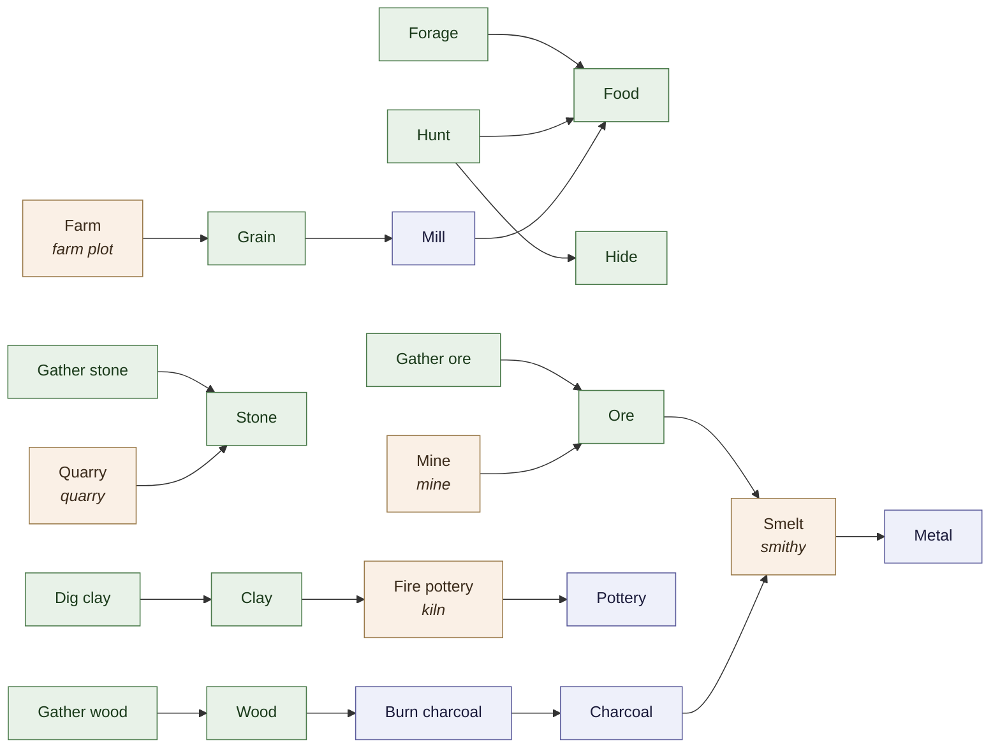
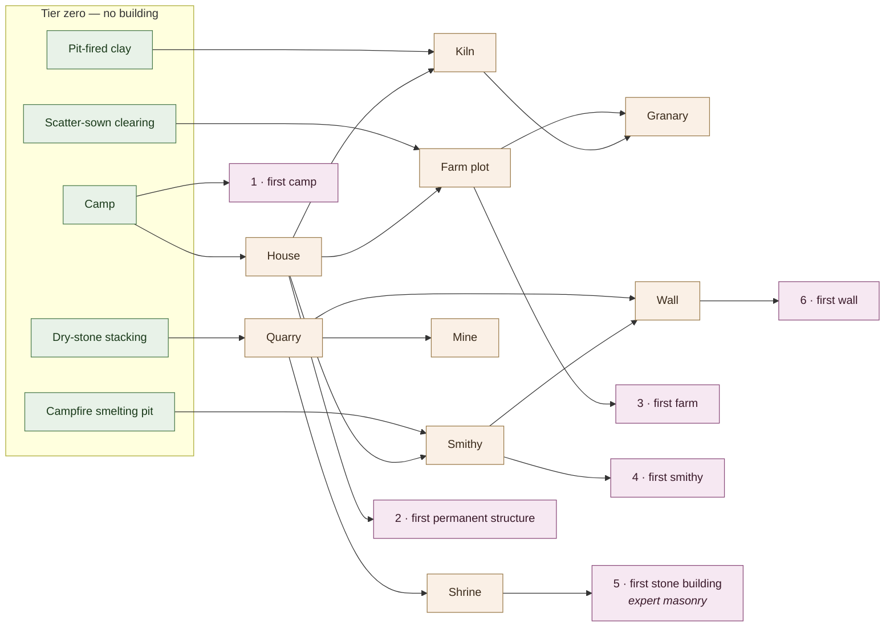

# Kingdom Watch — The Economy Ladder

The contents of the economy: what the resources are, what chains connect them,
which jobs and buildings exist, and what the six progression milestones
actually mean as conditions the simulation can test.

The [design plan](kingdom-watch-plan-v7.1.md) §9 explains *why* the economy is
shaped this way — a capability graph rather than a tech tree, skill tiers to
resolve the smithing chicken-and-egg. This document is the *what*. It exists
because §9 committed to "~10 resources with two-step chains" and to five gates
on every building without ever naming a resource, a building or a milestone
condition, which left #22, #23, #26, #37 and #53 each inventing the piece they
needed (#78).

**This is a map, not a schema.** Nothing here is implemented. `ResourceKind`,
`JobKind`, `Recipe` and `PrimitiveTier` are untouched by the change that added
this file, and the M1 slice — Food, Wood, Stone, gathering only — stands as
#52 built it.

> **Table order is presentational.** `ResourceKind` and `JobKind` are
> append-only and persisted, and the order in which the values below are
> *appended* is deliberately not decided here — that belongs to the issue
> doing the appending (#22 for jobs, #37 for resources). Read the rows as a
> set. The three values that already exist carry their real numbers, and those
> are permanent.

---

## 1. Resources

Ten kinds. Three exist; seven are named here and appended by later issues.

**Depth** is how many craft steps separate a kind from the world: a gathered
kind is depth 0, and a crafted kind is one more than its deepest input. §9's
"two-step chains" is the rule that nothing exceeds depth 2, which keeps the
graph inspectable and the deadlock surface small.

| Resource | Enum | Depth | Source | Notes |
|---|---|---|---|---|
| Food | `ResourceKind.Food = 1` | 0 | Foraged, hunted, or milled from Grain | Perishable. The only kind anyone dies without. |
| Wood | `ResourceKind.Wood = 2` | 0 | Gathered deadfall, later felled timber | |
| Stone | `ResourceKind.Stone = 3` | 0 | Loose surface stone, later quarried | |
| Grain | *appended later* | 0 | Harvested from a farm plot | Stores over winter, unlike Food. The point of farming. |
| Hide | *appended later* | 0 | Hunting, as a second output alongside Food | Clothing, and the tents a band camps under. |
| Clay | *appended later* | 0 | Dug from riverbank cells | |
| Charcoal | *appended later* | 1 | Wood burnt in a pit, better in a kiln | |
| Pottery | *appended later* | 1 | Clay fired in a kiln | Storage capacity — what a granary is made of. |
| Ore | *appended later* | 0 | Surface nodules and bog iron, later mined | |
| Metal | *appended later* | 2 | Ore + Charcoal, smelted | §9's `iron_tools` chain. |

### Chains

| Recipe | Inputs | Outputs | Needs | Substitutes | Degrades to |
|---|---|---|---|---|---|
| Forage | — | Food | — | Hunt, Mill | — |
| Hunt | — | Food, Hide | — | Forage | — |
| Gather wood | — | Wood | — | — | — |
| Gather stone | — | Stone | — | Quarry | — |
| Dig clay | — | Clay | riverbank | — | — |
| Farm | — | Grain | farm plot | — | — |
| Mill | Grain | Food | — | Forage, Hunt | — |
| Burn charcoal | Wood | Charcoal | — | — | raw Wood, worse yield |
| Fire pottery | Clay | Pottery | kiln | — | baskets and hide sacks, less capacity |
| Gather ore | — | Ore | — | Mine | — |
| Quarry | — | Stone | quarry | Gather stone | — |
| Mine | — | Ore | mine | Gather ore | — |
| Smelt | Ore, Charcoal | Metal | smithy | — | stone tools, then bone tools |

Three of these are what `PrimitiveTier` already ships — Forage, Gather wood,
Gather stone — with their placeholder quantities and durations unchanged.

### The rule that keeps it from deadlocking

§9 requires a substitution list and a degradation path on every recipe, and a
harness test of 200 years with no settlement ever deadlocking. The property
that makes that test passable is stated here so later additions can be checked
against it:

> **No survival-critical resource has a single source, and no single-source
> resource is survival-critical.**

Food has three independent sources and two of them need no building, so a
settlement that loses its farm forages.

Four kinds have a single source — Wood, Grain, Clay and Metal — and none of
them is survival-critical:

- **Grain** exists only to become Food, which foraging and hunting also supply.
- **Clay** exists only to become Pottery, which baskets and hide sacks
  substitute for.
- **Metal** improves rates and tool durability; stone tools, then bone tools,
  do the same jobs slower. That is §9's `degrades_to` chain.
- **Wood** is needed to build rather than to live. A band that can reach no
  forest stays nomadic, which #54 already models as an ordinary outcome rather
  than a failure.

**No building is gated on a single-source resource either**, which is the same
rule applied one level up: the granary's Pottery degrades to baskets, and the
smithy takes charcoal from a pit where there is no kiln. So a map with no clay
— or no river to dig it from — still reaches the end of the ladder.

Adding an eleventh resource means re-checking these lists, not just adding a
row.

### One fork left open

Whether a finished **tool** is ledger stock or personal property is not
decided here. §6 gives individuals their tools and §9's worked example makes
`iron_tools` a recipe output, and `ResourceKind`'s own remark flags the
conflict. The map works either way: **Metal** is the ledger resource, and
whether the smith's output is a stocked kind or an item on a person belongs to
#68, which owns personal property. Nothing above depends on the answer.

---

## 2. Jobs by tier

A job is a standing role, not a recipe index — `JobKind`'s remark already
carves out the roles that are not recipes at all.

### Tier zero — no building, no tools

| Job | Enum | Runs |
|---|---|---|
| Forager | `JobKind.Forager = 1` | Forage |
| Woodcutter | `JobKind.Woodcutter = 2` | Gather wood |
| StoneGatherer | `JobKind.StoneGatherer = 3` | Gather stone |
| Hunter | *appended later* | Hunt |
| ClayDigger | *appended later* | Dig clay |
| OreGatherer | *appended later* | Gather ore |

### Building-gated

| Job | Needs | Runs |
|---|---|---|
| Farmer | farm plot | Farm |
| Quarrier | quarry | Quarry |
| Miner | mine | Mine |
| Collier | kiln | Burn charcoal |
| Potter | kiln | Fire pottery |
| Smith | smithy | Smelt |

### Not recipes at all

| Job | What it does |
|---|---|
| Builder | Turns hauled materials into a building. Consumes, produces nothing. |
| Hauler | Moves stock between site, store and workshop. |
| Priest | Shrine attendance and attribution (§11). No economic output. |

Milling is deliberately not a job. A quern is tier-zero household work, so
Grain becomes Food without anyone holding a role for it — which is what stops
a farming settlement starving because nobody took the miller post.

---

## 3. Buildings

Each with §9's five gates: minimum relevant skill, necessary inputs,
prerequisite infrastructure, sufficient labour surplus, and actual settlement
demand. Labour surplus and demand are per-settlement conditions rather than
fixed numbers, so they are described rather than tabulated.

| Building | Min skill | Inputs | Prerequisite | Enables |
|---|---|---|---|---|
| Camp | — | Wood | — | Settling at all (#54) |
| House | Novice construction | Wood | a camp | Households with a real home (#69) |
| Farm plot | Novice farming | Wood | cleared land, a house | Grain |
| Granary | Apprentice construction | Wood, Pottery | a farm | Grain surviving winter |
| Kiln | Apprentice pottery | Clay, Wood | a house | Pottery, and charcoal at better yield |
| Quarry | Apprentice masonry | Wood | hills in reach | Stone at rate |
| Mine | Journeyman masonry | Wood | hills in reach, a quarry | Ore |
| Smithy | Journeyman metalworking | Stone, Charcoal | a house | Metal |
| Shrine | **Expert masonry** | Stone | a quarry | Priests and attribution (§11); the first dressed-stone building |
| Wall | Expert masonry | Stone, Metal | a quarry, a smithy | The last milestone |

Masonry is the one capability that climbs the whole way, and the table is
arranged so that it does: dry-stone stacking at tier zero, a quarry at
apprentice, a mine at journeyman, and dressed stone — the shrine, then the
wall — at expert. **Buildings that merely contain stone do not count as stone
construction**, which is why the kiln takes clay and wood and why the smithy
is gated on metalworking rather than masonry. Without that distinction the
"first stone building" milestone fires on whichever building happens to list
Stone among its inputs, which would put it before the smithy and inverted
against the ladder in §5.

The smithy is deliberately gated on skill rather than on a kiln or a mine.
Charcoal burns in a pit and surface ore is gathered like surface stone, so
neither building is a precondition — and making them one would put the whole
metal branch behind a river (for the kiln's clay) and behind journeyman
masonry (for the mine), which is the chicken-and-egg §9 exists to prevent,
reintroduced one rung up.

Placement preferences are §12's town planner (#23) and are not repeated here.
This table says which buildings exist and what gates them; #23 says where they
go.

---

## 4. The capability graph

Eight capabilities, each with the five skill tiers of §9 —
Novice → Apprentice → Journeyman → Expert → Master.

§9's binding constraint is that **every capability must have a reachable path
from primitive life**, or the chicken-and-egg simply moves one rung up. The
check is per-capability and mechanical: each one needs a crude form that
requires no building, so skill can be built before the building that skill
gates.

| Capability | Crude form at tier zero | What skill then unlocks |
|---|---|---|
| Foraging | Forage | — (no building form) |
| Hunting | Hunt | — |
| Woodcraft | Gather wood | Felling at rate |
| Construction | Camp | House, then granary |
| Farming | Scatter-sown clearing | Farm plot |
| Pottery | Sun-dried and pit-fired clay | Kiln |
| Masonry | Dry-stone stacking | Quarry, shrine, then wall |
| Metalworking | Ore smelted in a campfire pit | Smithy |

A crude form runs the same chain as its building form, worse and slower, and
that is why only the building form appears in §1's chain table: a scatter-sown
clearing and a farm plot both yield Grain, and a campfire pit and a smithy both
yield Metal. The crude form is not a separate recipe to balance, it is the same
recipe without the building and at a penalty.

Metalworking is the case §9 works through: a novice works metal badly at a
pit, doing so builds skill, and at journeyman a smithy becomes viable — so the
technology climb is paced by human learning time rather than a timer, and
varies per world because it depends on who happens to be good at what.

Masonry is the same shape one tier higher: dry-stone work needs no building,
and expert masonry is what gates the wall.

**Every row above has a tier-zero entry, so the graph is reachable.** A new
capability is not finished until it has one.

---

## 5. The progression ladder

§9 and §16 both name the same six milestones. Here they are as conditions the
simulation can test, with §16's OR-conditions where a strict single condition
could softlock a world.

| # | Milestone | Fires when |
|---|---|---|
| 1 | First camp | A band's settling trigger fires (#54) |
| 2 | First permanent structure | A house completes |
| 3 | First farm | A farm plot yields its first Grain |
| 4 | First smithy | A smithy completes, OR Metal is first smelted at a pit |
| 5 | First stone building | A building requiring expert masonry completes — normally the shrine — OR an expert mason exists |
| 6 | First wall | A wall encloses a settlement, OR the settlement has stood a raid and has both a quarry and a smithy |

Milestones 4, 5 and 6 carry an OR because each can softlock: a world with no
reachable ore never builds a smithy or a wall, and a wholly peaceful world
never needs a wall at all. The alternate condition is in every case the
*capability* having been reached rather than the building existing, which is
what the milestone is really measuring — and it is what keeps an ore-less map
playable to the end of the ladder rather than stalling it at milestone 3.

### Target pacing

**These are placeholders, in the same sense as `PrimitiveTier`'s quantities
and durations: chosen to be plausible for the arc §1 describes, not tuned.
Nothing here should be read as a balance decision.**

They exist because §15 calls time to first journeyman "a critical pacing
number" and says to tune it in the harness early, and until something states a
target there is nothing to tune toward. `Harness/` currently has only
`SchedulerSoak.cs` as a workload, so none of these has been measured — the
first world run is #17.

| Milestone | Target | Confirmed by |
|---|---|---|
| First camp | year 0–2 | #17's first chronicle |
| First permanent structure | year 3–5 | #17 |
| First farm | year 8–15 | #17, then #53 once seasons gate sowing |
| **First journeyman, any craft** | **year 20–30** | #22, the number §15 names |
| First smithy | year 30–40 | #22 |
| First stone building | year 50–70 | #23 |
| First wall | year 70–100 | #23 |

A full ladder in roughly a century, against the ~1,650-person equilibrium of
§1 and the centuries §1 spans. The shape that matters more than the numbers:
the gap from farm to smithy is learning time, not construction time, and the
gap from smithy to wall is skill again. If tuning collapses either gap, the
capability climb has stopped being paced by people and the pacing lever §9
describes has been lost.

---

## 6. The graphs

Drawn rather than only tabulated, because a deadlock or an unreachable
capability is visible in a diagram by inspection and easy to miss in a table.

### Resource chains

Green is taken from the world, blue is made, tan needs a building. Every blue
node traces back to green in at most two hops, which is §9's two-step rule
holding.

### Capabilities and buildings

Every building traces back into the tier-zero box, which is the reachability
check in §4 drawn rather than asserted.

---

## What this does not decide

- **Implementation.** No enum gains a value and no recipe is written here.
  Jobs and skill tiers are #22, buildings and their placement #23, the road to
  ten resources #37, regeneration rates #26, seasonal reassignment #53, and
  workplaces in the daily schedule #21.
- **Append order.** See the note at the top.
- **Whether tools are stock or property.** #68.
- **Any pacing number as fact.** Every figure in §5 is a placeholder awaiting
  #17 and #22.
- **A tech tree.** §9 keeps "there is no research system" and "an explicit tech
  ladder is a v2 consideration at earliest", and §20 leaves explicit technology
  progression deferred. This enumerates the capability graph §9 already
  committed to; nobody researches anything.
