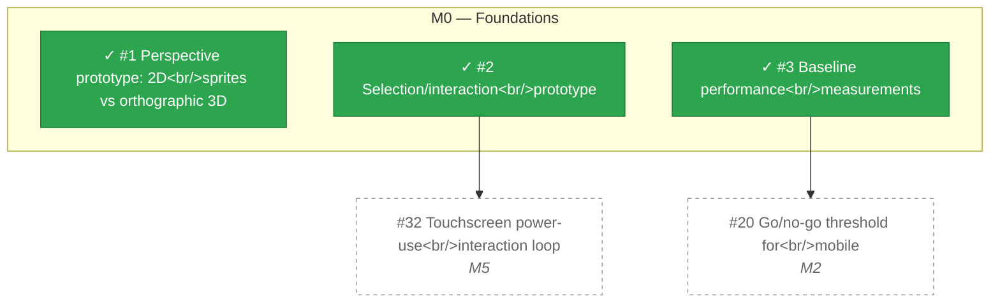

# M0 — Foundations

_Generated by `tools/Build-Roadmap.ps1` from GitHub issues. Do not edit by hand; the commit date is the generation date._

Art perspective decision and baseline performance measurements. No hard dependency on M1 (M1 is pure C#, zero Unity dependency) — the two tracks can run in parallel. M0 only needs to land before M2. See docs/design/kingdom-watch-plan-v7.1.md §18-19.

[Milestone on GitHub](https://github.com/zhollis21/KingdomWatch/milestone/1) · [Roadmap](README.md)

| Issue | Title | Priority | Status | Blocked by | Blocks |
|---|---|---|---|---|---|
| [#1](https://github.com/zhollis21/KingdomWatch/issues/1) | Perspective prototype: 2D sprites vs orthographic 3D | P0-blocker | ✓ done | — | — |
| [#2](https://github.com/zhollis21/KingdomWatch/issues/2) | Selection/interaction prototype | P1-high | ✓ done | — | [#32](https://github.com/zhollis21/KingdomWatch/issues/32) |
| [#3](https://github.com/zhollis21/KingdomWatch/issues/3) | Baseline performance measurements | P1-high | ✓ done | — | [#20](https://github.com/zhollis21/KingdomWatch/issues/20) |
