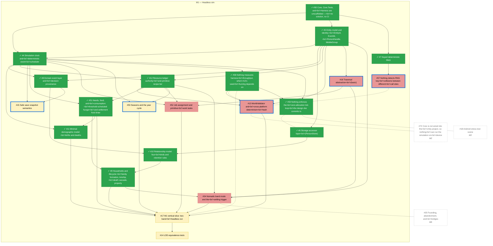

# M1 — Headless sim

_Generated by `tools/Build-Roadmap.ps1` from GitHub issues. Do not edit by hand; the commit date is the generation date._

Core simulation architecture: clock, entities, determinism, storage, households, relationships. Pure C#, zero Unity dependency — can proceed in parallel with M0. See §5-9, §19-20.

[Milestone on GitHub](https://github.com/zhollis21/KingdomWatch/milestone/2) · [Roadmap](README.md)

| Issue | Title | Priority | Status | Blocked by | Blocks |
|---|---|---|---|---|---|
| [#4](https://github.com/zhollis21/KingdomWatch/issues/4) | Simulation clock and deterministic event scheduler | P0-blocker | ✓ done | ✓[#5](https://github.com/zhollis21/KingdomWatch/issues/5), ✓[#50](https://github.com/zhollis21/KingdomWatch/issues/50) | ✓[#8](https://github.com/zhollis21/KingdomWatch/issues/8), ✓[#11](https://github.com/zhollis21/KingdomWatch/issues/11), ✓[#12](https://github.com/zhollis21/KingdomWatch/issues/12), [#15](https://github.com/zhollis21/KingdomWatch/issues/15), ✓[#51](https://github.com/zhollis21/KingdomWatch/issues/51), [#52](https://github.com/zhollis21/KingdomWatch/issues/52), [#53](https://github.com/zhollis21/KingdomWatch/issues/53), ✓[#58](https://github.com/zhollis21/KingdomWatch/issues/58), ✓[#59](https://github.com/zhollis21/KingdomWatch/issues/59) |
| [#5](https://github.com/zhollis21/KingdomWatch/issues/5) | Entity model and identity: EntityId, EventId, PersonHandle, MobileGroup | P0-blocker | ✓ done | ✓[#50](https://github.com/zhollis21/KingdomWatch/issues/50) | ✓[#4](https://github.com/zhollis21/KingdomWatch/issues/4), ✓[#6](https://github.com/zhollis21/KingdomWatch/issues/6), ✓[#8](https://github.com/zhollis21/KingdomWatch/issues/8), ✓[#12](https://github.com/zhollis21/KingdomWatch/issues/12), [#13](https://github.com/zhollis21/KingdomWatch/issues/13), [#16](https://github.com/zhollis21/KingdomWatch/issues/16), [#54](https://github.com/zhollis21/KingdomWatch/issues/54) |
| [#6](https://github.com/zhollis21/KingdomWatch/issues/6) | Storage accessor layer (PersonStore) | P0-blocker | ✓ done | ✓[#5](https://github.com/zhollis21/KingdomWatch/issues/5) | ✓[#10](https://github.com/zhollis21/KingdomWatch/issues/10) |
| [#7](https://github.com/zhollis21/KingdomWatch/issues/7) | Keyed deterministic RNG | P0-blocker | ✓ done | ✓[#50](https://github.com/zhollis21/KingdomWatch/issues/50) | [#57](https://github.com/zhollis21/KingdomWatch/issues/57) |
| [#50](https://github.com/zhollis21/KingdomWatch/issues/50) | Core, Core.Tests, and Harness are unscaffolded — no solution, no CI | P0-blocker | ✓ done | — | ✓[#4](https://github.com/zhollis21/KingdomWatch/issues/4), ✓[#5](https://github.com/zhollis21/KingdomWatch/issues/5), ✓[#7](https://github.com/zhollis21/KingdomWatch/issues/7), [#72](https://github.com/zhollis21/KingdomWatch/issues/72) |
| [#8](https://github.com/zhollis21/KingdomWatch/issues/8) | Domain event layer and decision provenance | P1-high | ✓ done | ✓[#4](https://github.com/zhollis21/KingdomWatch/issues/4), ✓[#5](https://github.com/zhollis21/KingdomWatch/issues/5) | ✓[#10](https://github.com/zhollis21/KingdomWatch/issues/10), [#15](https://github.com/zhollis21/KingdomWatch/issues/15), [#29](https://github.com/zhollis21/KingdomWatch/issues/29), [#43](https://github.com/zhollis21/KingdomWatch/issues/43), [#73](https://github.com/zhollis21/KingdomWatch/issues/73), [#74](https://github.com/zhollis21/KingdomWatch/issues/74) |
| [#9](https://github.com/zhollis21/KingdomWatch/issues/9) | Households and lifecycle: family formation, kinship, death cascade, property | P1-high | ✓ done | ✓[#10](https://github.com/zhollis21/KingdomWatch/issues/10), ✓[#51](https://github.com/zhollis21/KingdomWatch/issues/51) | [#17](https://github.com/zhollis21/KingdomWatch/issues/17), [#22](https://github.com/zhollis21/KingdomWatch/issues/22), [#38](https://github.com/zhollis21/KingdomWatch/issues/38), [#40](https://github.com/zhollis21/KingdomWatch/issues/40), [#54](https://github.com/zhollis21/KingdomWatch/issues/54), [#68](https://github.com/zhollis21/KingdomWatch/issues/68), [#69](https://github.com/zhollis21/KingdomWatch/issues/69) |
| [#10](https://github.com/zhollis21/KingdomWatch/issues/10) | Relationship model: four kinds and retention rules | P1-high | ✓ done | ✓[#6](https://github.com/zhollis21/KingdomWatch/issues/6), ✓[#8](https://github.com/zhollis21/KingdomWatch/issues/8) | ✓[#9](https://github.com/zhollis21/KingdomWatch/issues/9), [#36](https://github.com/zhollis21/KingdomWatch/issues/36), [#41](https://github.com/zhollis21/KingdomWatch/issues/41) |
| [#11](https://github.com/zhollis21/KingdomWatch/issues/11) | Minimal demographic model: births and deaths | P1-high | ✓ done | ✓[#4](https://github.com/zhollis21/KingdomWatch/issues/4), ✓[#51](https://github.com/zhollis21/KingdomWatch/issues/51) | [#17](https://github.com/zhollis21/KingdomWatch/issues/17), [#29](https://github.com/zhollis21/KingdomWatch/issues/29) |
| [#12](https://github.com/zhollis21/KingdomWatch/issues/12) | Resource ledger authority and primitive recipe tier | P1-high | ✓ done | ✓[#4](https://github.com/zhollis21/KingdomWatch/issues/4), ✓[#5](https://github.com/zhollis21/KingdomWatch/issues/5) | [#13](https://github.com/zhollis21/KingdomWatch/issues/13), [#24](https://github.com/zhollis21/KingdomWatch/issues/24), ✓[#51](https://github.com/zhollis21/KingdomWatch/issues/51), [#52](https://github.com/zhollis21/KingdomWatch/issues/52), [#53](https://github.com/zhollis21/KingdomWatch/issues/53), [#54](https://github.com/zhollis21/KingdomWatch/issues/54) |
| [#13](https://github.com/zhollis21/KingdomWatch/issues/13) | WorldValidator and cross-platform determinism hash | P1-high | **ready** | ✓[#5](https://github.com/zhollis21/KingdomWatch/issues/5), ✓[#12](https://github.com/zhollis21/KingdomWatch/issues/12), ✓[#58](https://github.com/zhollis21/KingdomWatch/issues/58) | [#17](https://github.com/zhollis21/KingdomWatch/issues/17), [#33](https://github.com/zhollis21/KingdomWatch/issues/33) |
| [#16](https://github.com/zhollis21/KingdomWatch/issues/16) | Traversal abstraction (basic) | P1-high | **ready** | ✓[#5](https://github.com/zhollis21/KingdomWatch/issues/5) | [#23](https://github.com/zhollis21/KingdomWatch/issues/23), [#25](https://github.com/zhollis21/KingdomWatch/issues/25), [#27](https://github.com/zhollis21/KingdomWatch/issues/27), [#33](https://github.com/zhollis21/KingdomWatch/issues/33), [#35](https://github.com/zhollis21/KingdomWatch/issues/35), [#37](https://github.com/zhollis21/KingdomWatch/issues/37), [#45](https://github.com/zhollis21/KingdomWatch/issues/45), [#52](https://github.com/zhollis21/KingdomWatch/issues/52), [#54](https://github.com/zhollis21/KingdomWatch/issues/54) |
| [#51](https://github.com/zhollis21/KingdomWatch/issues/51) | Needs, food, and consumption: threshold-scheduled hunger and settlement food draw | P1-high | ✓ done | ✓[#4](https://github.com/zhollis21/KingdomWatch/issues/4), ✓[#12](https://github.com/zhollis21/KingdomWatch/issues/12) | ✓[#9](https://github.com/zhollis21/KingdomWatch/issues/9), ✓[#11](https://github.com/zhollis21/KingdomWatch/issues/11), [#17](https://github.com/zhollis21/KingdomWatch/issues/17) |
| [#52](https://github.com/zhollis21/KingdomWatch/issues/52) | Job assignment and primitive work tasks | P1-high | blocked | ✓[#4](https://github.com/zhollis21/KingdomWatch/issues/4), ✓[#12](https://github.com/zhollis21/KingdomWatch/issues/12), [#16](https://github.com/zhollis21/KingdomWatch/issues/16) | [#17](https://github.com/zhollis21/KingdomWatch/issues/17), [#21](https://github.com/zhollis21/KingdomWatch/issues/21), [#22](https://github.com/zhollis21/KingdomWatch/issues/22), [#23](https://github.com/zhollis21/KingdomWatch/issues/23), [#24](https://github.com/zhollis21/KingdomWatch/issues/24), [#26](https://github.com/zhollis21/KingdomWatch/issues/26), [#29](https://github.com/zhollis21/KingdomWatch/issues/29), [#37](https://github.com/zhollis21/KingdomWatch/issues/37), [#38](https://github.com/zhollis21/KingdomWatch/issues/38) |
| [#54](https://github.com/zhollis21/KingdomWatch/issues/54) | Nomadic band mode and the settling trigger | P1-high | blocked | ✓[#5](https://github.com/zhollis21/KingdomWatch/issues/5), ✓[#9](https://github.com/zhollis21/KingdomWatch/issues/9), ✓[#12](https://github.com/zhollis21/KingdomWatch/issues/12), [#16](https://github.com/zhollis21/KingdomWatch/issues/16) | [#17](https://github.com/zhollis21/KingdomWatch/issues/17), [#23](https://github.com/zhollis21/KingdomWatch/issues/23), [#27](https://github.com/zhollis21/KingdomWatch/issues/27), [#34](https://github.com/zhollis21/KingdomWatch/issues/34), [#35](https://github.com/zhollis21/KingdomWatch/issues/35), [#69](https://github.com/zhollis21/KingdomWatch/issues/69) |
| [#57](https://github.com/zhollis21/KingdomWatch/issues/57) | Nothing detects RNG key collisions between different call sites | P1-high | **ready** | ✓[#7](https://github.com/zhollis21/KingdomWatch/issues/7) | — |
| [#58](https://github.com/zhollis21/KingdomWatch/issues/58) | Nothing measures harness throughput, which #13's seed fuzzing depends on | P1-high | ✓ done | ✓[#4](https://github.com/zhollis21/KingdomWatch/issues/4) | [#13](https://github.com/zhollis21/KingdomWatch/issues/13), ✓[#59](https://github.com/zhollis21/KingdomWatch/issues/59) |
| [#14](https://github.com/zhollis21/KingdomWatch/issues/14) | LOD equivalence tests | P2-normal | blocked | [#17](https://github.com/zhollis21/KingdomWatch/issues/17) | — |
| [#15](https://github.com/zhollis21/KingdomWatch/issues/15) | Safe save snapshot semantics | P2-normal | **ready** | ✓[#4](https://github.com/zhollis21/KingdomWatch/issues/4), ✓[#8](https://github.com/zhollis21/KingdomWatch/issues/8) | [#19](https://github.com/zhollis21/KingdomWatch/issues/19), [#42](https://github.com/zhollis21/KingdomWatch/issues/42) |
| [#17](https://github.com/zhollis21/KingdomWatch/issues/17) | M1 vertical slice: two-band headless run | P2-normal | blocked | ✓[#9](https://github.com/zhollis21/KingdomWatch/issues/9), ✓[#11](https://github.com/zhollis21/KingdomWatch/issues/11), [#13](https://github.com/zhollis21/KingdomWatch/issues/13), ✓[#51](https://github.com/zhollis21/KingdomWatch/issues/51), [#52](https://github.com/zhollis21/KingdomWatch/issues/52), [#53](https://github.com/zhollis21/KingdomWatch/issues/53), [#54](https://github.com/zhollis21/KingdomWatch/issues/54) | [#14](https://github.com/zhollis21/KingdomWatch/issues/14), [#18](https://github.com/zhollis21/KingdomWatch/issues/18), [#26](https://github.com/zhollis21/KingdomWatch/issues/26), [#33](https://github.com/zhollis21/KingdomWatch/issues/33) |
| [#53](https://github.com/zhollis21/KingdomWatch/issues/53) | Seasons and the year cycle | P2-normal | **ready** | ✓[#4](https://github.com/zhollis21/KingdomWatch/issues/4), ✓[#12](https://github.com/zhollis21/KingdomWatch/issues/12) | [#17](https://github.com/zhollis21/KingdomWatch/issues/17), [#21](https://github.com/zhollis21/KingdomWatch/issues/21) |
| [#59](https://github.com/zhollis21/KingdomWatch/issues/59) | Nothing enforces the zero-allocation tick loop the design doc commits to | P2-normal | ✓ done | ✓[#4](https://github.com/zhollis21/KingdomWatch/issues/4), ✓[#58](https://github.com/zhollis21/KingdomWatch/issues/58) | — |
