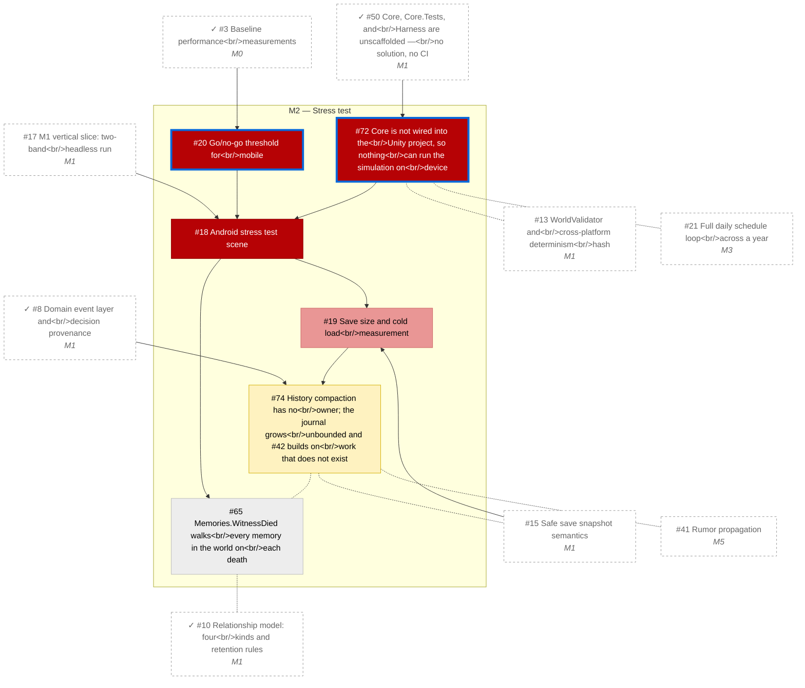

# M2 — Stress test

_Generated by `tools/Build-Roadmap.ps1` from GitHub issues. Do not edit by hand; the commit date is the generation date._

Go/no-go for mobile: full-population stress test on Android with no art. Requires M0 (perspective) and M1 (sim) complete. See §19.

[Milestone on GitHub](https://github.com/zhollis21/KingdomWatch/milestone/3) · [Roadmap](README.md)

| Issue | Title | Priority | Status | Blocked by | Blocks |
|---|---|---|---|---|---|
| [#18](https://github.com/zhollis21/KingdomWatch/issues/18) | Android stress test scene | P0-blocker | blocked | [#17](https://github.com/zhollis21/KingdomWatch/issues/17), [#20](https://github.com/zhollis21/KingdomWatch/issues/20), [#72](https://github.com/zhollis21/KingdomWatch/issues/72) | [#19](https://github.com/zhollis21/KingdomWatch/issues/19), [#65](https://github.com/zhollis21/KingdomWatch/issues/65) |
| [#20](https://github.com/zhollis21/KingdomWatch/issues/20) | Go/no-go threshold for mobile | P0-blocker | **ready** | ✓[#3](https://github.com/zhollis21/KingdomWatch/issues/3) | [#18](https://github.com/zhollis21/KingdomWatch/issues/18) |
| [#72](https://github.com/zhollis21/KingdomWatch/issues/72) | Core is not wired into the Unity project, so nothing can run the simulation on device | P0-blocker | **ready** | ✓[#50](https://github.com/zhollis21/KingdomWatch/issues/50) | [#18](https://github.com/zhollis21/KingdomWatch/issues/18), [#73](https://github.com/zhollis21/KingdomWatch/issues/73) |
| [#19](https://github.com/zhollis21/KingdomWatch/issues/19) | Save size and cold load measurement | P1-high | blocked | [#15](https://github.com/zhollis21/KingdomWatch/issues/15), [#18](https://github.com/zhollis21/KingdomWatch/issues/18) | [#74](https://github.com/zhollis21/KingdomWatch/issues/74) |
| [#74](https://github.com/zhollis21/KingdomWatch/issues/74) | History compaction has no owner; the journal grows unbounded and #42 builds on work that does not exist | P2-normal | blocked | ✓[#8](https://github.com/zhollis21/KingdomWatch/issues/8), [#19](https://github.com/zhollis21/KingdomWatch/issues/19) | [#42](https://github.com/zhollis21/KingdomWatch/issues/42) |
| [#65](https://github.com/zhollis21/KingdomWatch/issues/65) | Memories.WitnessDied walks every memory in the world on each death | P3-someday | blocked | [#18](https://github.com/zhollis21/KingdomWatch/issues/18) | — |
