# M3 — Living village

_Generated by `tools/Build-Roadmap.ps1` from GitHub issues. Do not edit by hand; the commit date is the generation date._

One well laid out village running a full year: schedules, skills, town planner, reservations. See §19.

[Milestone on GitHub](https://github.com/zhollis21/KingdomWatch/milestone/4) · [Roadmap](README.md)

```mermaid
flowchart TD
  subgraph MSM3Livingvillage["M3 — Living village"]
    direction TD
    I21["#21 Full daily schedule loop#lt;br/#gt;across a year"]:::p1
    I22["#22 Skills, apprenticeship, and#lt;br/#gt;age stages"]:::p1
    I23["#23 Town planner (settlement#lt;br/#gt;layout AI)"]:::p0
    I24["#24 Resource reservation system"]:::p1
    I25["#25 Movement and collision model"]:::p1
    I26["#26 Resource regeneration"]:::p2
    I68["#68 Nothing represents personal#lt;br/#gt;property, so the death#lt;br/#gt;cascade has no wealth or#lt;br/#gt;tools to transfer"]:::p2
    I69["#69 Household formation has no#lt;br/#gt;housing stock behind it once#lt;br/#gt;a band settles"]:::p1
    I73["#73 No issue builds the event#lt;br/#gt;feed that §16 calls the#lt;br/#gt;entire interface to what#lt;br/#gt;happened"]:::p1
  end
  I8["✓ #8 Domain event layer and#lt;br/#gt;decision provenance<br/><i>M1</i>"]:::ext
  I9["✓ #9 Households and lifecycle:#lt;br/#gt;family formation, kinship,#lt;br/#gt;death cascade, property<br/><i>M1</i>"]:::ext
  I12["✓ #12 Resource ledger authority#lt;br/#gt;and primitive recipe tier<br/><i>M1</i>"]:::ext
  I16["#16 Traversal abstraction#lt;br/#gt;(basic)<br/><i>M1</i>"]:::ext
  I17["#17 M1 vertical slice: two-band#lt;br/#gt;headless run<br/><i>M1</i>"]:::ext
  I18["#18 Android stress test scene<br/><i>M2</i>"]:::ext
  I32["#32 Touchscreen power-use#lt;br/#gt;interaction loop<br/><i>M5</i>"]:::ext
  I35["#35 Founding, abandonment, and#lt;br/#gt;bridges<br/><i>M6</i>"]:::ext
  I37["#37 Trade and economy toward 10#lt;br/#gt;resources<br/><i>M6</i>"]:::ext
  I44["#44 Event feed follow lists and#lt;br/#gt;search<br/><i>M7</i>"]:::ext
  I52["#52 Job assignment and primitive#lt;br/#gt;work tasks<br/><i>M1</i>"]:::ext
  I53["#53 Seasons and the year cycle<br/><i>M1</i>"]:::ext
  I54["#54 Nomadic band mode and the#lt;br/#gt;settling trigger<br/><i>M1</i>"]:::ext
  I72["#72 Core is not wired into the#lt;br/#gt;Unity project, so nothing#lt;br/#gt;can run the simulation on#lt;br/#gt;device<br/><i>M2</i>"]:::ext
  I22 --> I21
  I23 --> I21
  I24 --> I21
  I25 --> I21
  I52 --> I21
  I53 --> I21
  I9 --> I22
  I52 --> I22
  I16 --> I23
  I52 --> I23
  I54 --> I23
  I12 --> I24
  I52 --> I24
  I16 --> I25
  I25 -.- I18
  I17 --> I26
  I52 --> I26
  I9 --> I68
  I22 --> I68
  I68 -.- I37
  I9 --> I69
  I23 --> I69
  I54 --> I69
  I69 -.- I35
  I8 --> I73
  I21 --> I73
  I72 --> I73
  I73 -.- I32
  I73 -.- I44
  classDef p0 fill:#b60205,color:#fff,stroke:#8c0000
  classDef p1 fill:#e99695,color:#000,stroke:#c66
  classDef p2 fill:#fef2c0,color:#000,stroke:#d4b106
  classDef p3 fill:#ededed,color:#000,stroke:#bbb
  classDef none fill:#fff,color:#000,stroke:#999
  classDef done fill:#2da44e,color:#fff,stroke:#1a7f37
  classDef ext fill:#fff,color:#666,stroke:#999,stroke-dasharray:4 4
```

| Issue | Title | Priority | Status | Blocked by | Blocks |
|---|---|---|---|---|---|
| [#23](https://github.com/zhollis21/KingdomWatch/issues/23) | Town planner (settlement layout AI) | P0-blocker | blocked | [#16](https://github.com/zhollis21/KingdomWatch/issues/16), [#52](https://github.com/zhollis21/KingdomWatch/issues/52), [#54](https://github.com/zhollis21/KingdomWatch/issues/54) | [#21](https://github.com/zhollis21/KingdomWatch/issues/21), [#28](https://github.com/zhollis21/KingdomWatch/issues/28), [#30](https://github.com/zhollis21/KingdomWatch/issues/30), [#35](https://github.com/zhollis21/KingdomWatch/issues/35), [#69](https://github.com/zhollis21/KingdomWatch/issues/69) |
| [#21](https://github.com/zhollis21/KingdomWatch/issues/21) | Full daily schedule loop across a year | P1-high | blocked | [#22](https://github.com/zhollis21/KingdomWatch/issues/22), [#23](https://github.com/zhollis21/KingdomWatch/issues/23), [#24](https://github.com/zhollis21/KingdomWatch/issues/24), [#25](https://github.com/zhollis21/KingdomWatch/issues/25), [#52](https://github.com/zhollis21/KingdomWatch/issues/52), [#53](https://github.com/zhollis21/KingdomWatch/issues/53) | [#28](https://github.com/zhollis21/KingdomWatch/issues/28), [#73](https://github.com/zhollis21/KingdomWatch/issues/73) |
| [#22](https://github.com/zhollis21/KingdomWatch/issues/22) | Skills, apprenticeship, and age stages | P1-high | blocked | ✓[#9](https://github.com/zhollis21/KingdomWatch/issues/9), [#52](https://github.com/zhollis21/KingdomWatch/issues/52) | [#21](https://github.com/zhollis21/KingdomWatch/issues/21), [#38](https://github.com/zhollis21/KingdomWatch/issues/38), [#68](https://github.com/zhollis21/KingdomWatch/issues/68) |
| [#24](https://github.com/zhollis21/KingdomWatch/issues/24) | Resource reservation system | P1-high | blocked | ✓[#12](https://github.com/zhollis21/KingdomWatch/issues/12), [#52](https://github.com/zhollis21/KingdomWatch/issues/52) | [#21](https://github.com/zhollis21/KingdomWatch/issues/21) |
| [#25](https://github.com/zhollis21/KingdomWatch/issues/25) | Movement and collision model | P1-high | blocked | [#16](https://github.com/zhollis21/KingdomWatch/issues/16) | [#21](https://github.com/zhollis21/KingdomWatch/issues/21) |
| [#69](https://github.com/zhollis21/KingdomWatch/issues/69) | Household formation has no housing stock behind it once a band settles | P1-high | blocked | ✓[#9](https://github.com/zhollis21/KingdomWatch/issues/9), [#23](https://github.com/zhollis21/KingdomWatch/issues/23), [#54](https://github.com/zhollis21/KingdomWatch/issues/54) | — |
| [#73](https://github.com/zhollis21/KingdomWatch/issues/73) | No issue builds the event feed that §16 calls the entire interface to what happened | P1-high | blocked | ✓[#8](https://github.com/zhollis21/KingdomWatch/issues/8), [#21](https://github.com/zhollis21/KingdomWatch/issues/21), [#72](https://github.com/zhollis21/KingdomWatch/issues/72) | [#32](https://github.com/zhollis21/KingdomWatch/issues/32), [#44](https://github.com/zhollis21/KingdomWatch/issues/44) |
| [#26](https://github.com/zhollis21/KingdomWatch/issues/26) | Resource regeneration | P2-normal | blocked | [#17](https://github.com/zhollis21/KingdomWatch/issues/17), [#52](https://github.com/zhollis21/KingdomWatch/issues/52) | — |
| [#68](https://github.com/zhollis21/KingdomWatch/issues/68) | Nothing represents personal property, so the death cascade has no wealth or tools to transfer | P2-normal | blocked | ✓[#9](https://github.com/zhollis21/KingdomWatch/issues/9), [#22](https://github.com/zhollis21/KingdomWatch/issues/22) | — |
