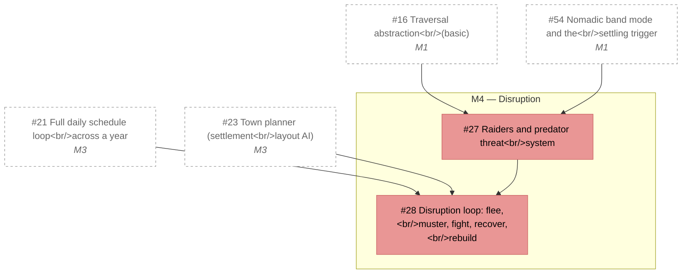

# M4 — Disruption

_Generated by `tools/Build-Roadmap.ps1` from GitHub issues. Do not edit by hand; the commit date is the generation date._

Raiders and predators: flee, muster, fight, recover, rebuild. See §19.

[Milestone on GitHub](https://github.com/zhollis21/KingdomWatch/milestone/5) · [Roadmap](README.md)

| Issue | Title | Priority | Status | Blocked by | Blocks |
|---|---|---|---|---|---|
| [#27](https://github.com/zhollis21/KingdomWatch/issues/27) | Raiders and predator threat system | P1-high | blocked | [#16](https://github.com/zhollis21/KingdomWatch/issues/16), [#54](https://github.com/zhollis21/KingdomWatch/issues/54) | [#28](https://github.com/zhollis21/KingdomWatch/issues/28) |
| [#28](https://github.com/zhollis21/KingdomWatch/issues/28) | Disruption loop: flee, muster, fight, recover, rebuild | P1-high | blocked | [#21](https://github.com/zhollis21/KingdomWatch/issues/21), [#23](https://github.com/zhollis21/KingdomWatch/issues/23), [#27](https://github.com/zhollis21/KingdomWatch/issues/27) | — |
