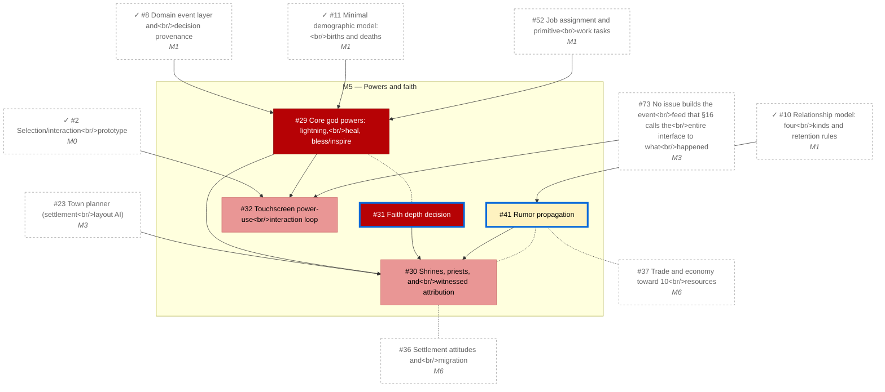

# M5 — Powers and faith

_Generated by `tools/Build-Roadmap.ps1` from GitHub issues. Do not edit by hand; the commit date is the generation date._

First god powers, shrines, faith depth decision. See §11, §16, §19.

[Milestone on GitHub](https://github.com/zhollis21/KingdomWatch/milestone/6) · [Roadmap](README.md)

| Issue | Title | Priority | Status | Blocked by | Blocks |
|---|---|---|---|---|---|
| [#29](https://github.com/zhollis21/KingdomWatch/issues/29) | Core god powers: lightning, heal, bless/inspire | P0-blocker | blocked | ✓[#8](https://github.com/zhollis21/KingdomWatch/issues/8), ✓[#11](https://github.com/zhollis21/KingdomWatch/issues/11), [#52](https://github.com/zhollis21/KingdomWatch/issues/52) | [#30](https://github.com/zhollis21/KingdomWatch/issues/30), [#32](https://github.com/zhollis21/KingdomWatch/issues/32) |
| [#31](https://github.com/zhollis21/KingdomWatch/issues/31) | Faith depth decision | P0-blocker | **ready** | — | [#30](https://github.com/zhollis21/KingdomWatch/issues/30) |
| [#30](https://github.com/zhollis21/KingdomWatch/issues/30) | Shrines, priests, and witnessed attribution | P1-high | blocked | [#23](https://github.com/zhollis21/KingdomWatch/issues/23), [#29](https://github.com/zhollis21/KingdomWatch/issues/29), [#31](https://github.com/zhollis21/KingdomWatch/issues/31), [#41](https://github.com/zhollis21/KingdomWatch/issues/41) | — |
| [#32](https://github.com/zhollis21/KingdomWatch/issues/32) | Touchscreen power-use interaction loop | P1-high | blocked | ✓[#2](https://github.com/zhollis21/KingdomWatch/issues/2), [#29](https://github.com/zhollis21/KingdomWatch/issues/29), [#73](https://github.com/zhollis21/KingdomWatch/issues/73) | — |
| [#41](https://github.com/zhollis21/KingdomWatch/issues/41) | Rumor propagation | P2-normal | **ready** | ✓[#10](https://github.com/zhollis21/KingdomWatch/issues/10) | [#30](https://github.com/zhollis21/KingdomWatch/issues/30) |
