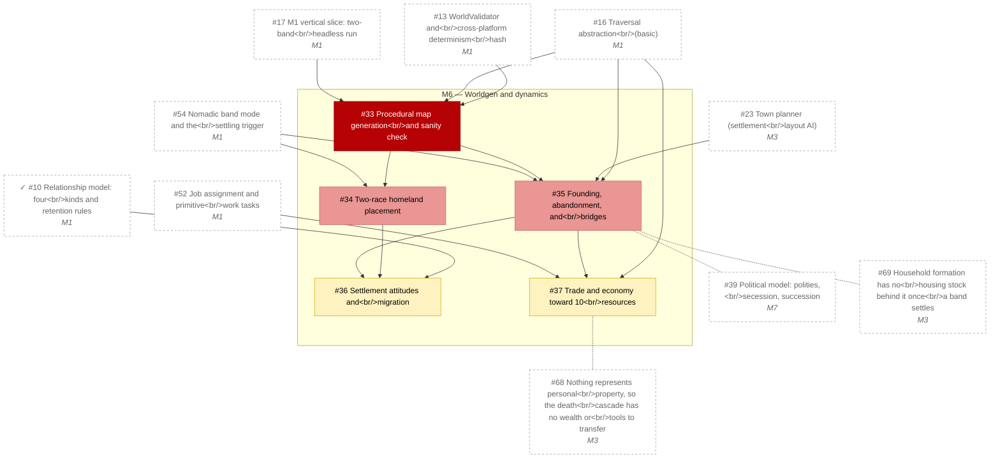

# M6 — Worldgen and dynamics

_Generated by `tools/Build-Roadmap.ps1` from GitHub issues. Do not edit by hand; the commit date is the generation date._

Procedural maps, homelands, founding/abandonment, bridges, attitudes, migration, trade economy toward 10 resources. See §15, §12, §10, §19.

[Milestone on GitHub](https://github.com/zhollis21/KingdomWatch/milestone/7) · [Roadmap](README.md)

| Issue | Title | Priority | Status | Blocked by | Blocks |
|---|---|---|---|---|---|
| [#33](https://github.com/zhollis21/KingdomWatch/issues/33) | Procedural map generation and sanity check | P0-blocker | blocked | [#13](https://github.com/zhollis21/KingdomWatch/issues/13), [#16](https://github.com/zhollis21/KingdomWatch/issues/16), [#17](https://github.com/zhollis21/KingdomWatch/issues/17) | [#34](https://github.com/zhollis21/KingdomWatch/issues/34), [#35](https://github.com/zhollis21/KingdomWatch/issues/35), [#45](https://github.com/zhollis21/KingdomWatch/issues/45), [#47](https://github.com/zhollis21/KingdomWatch/issues/47) |
| [#34](https://github.com/zhollis21/KingdomWatch/issues/34) | Two-race homeland placement | P1-high | blocked | [#33](https://github.com/zhollis21/KingdomWatch/issues/33), [#54](https://github.com/zhollis21/KingdomWatch/issues/54) | [#36](https://github.com/zhollis21/KingdomWatch/issues/36), [#39](https://github.com/zhollis21/KingdomWatch/issues/39) |
| [#35](https://github.com/zhollis21/KingdomWatch/issues/35) | Founding, abandonment, and bridges | P1-high | blocked | [#16](https://github.com/zhollis21/KingdomWatch/issues/16), [#23](https://github.com/zhollis21/KingdomWatch/issues/23), [#33](https://github.com/zhollis21/KingdomWatch/issues/33), [#54](https://github.com/zhollis21/KingdomWatch/issues/54) | [#36](https://github.com/zhollis21/KingdomWatch/issues/36), [#37](https://github.com/zhollis21/KingdomWatch/issues/37), [#39](https://github.com/zhollis21/KingdomWatch/issues/39) |
| [#36](https://github.com/zhollis21/KingdomWatch/issues/36) | Settlement attitudes and migration | P2-normal | blocked | ✓[#10](https://github.com/zhollis21/KingdomWatch/issues/10), [#34](https://github.com/zhollis21/KingdomWatch/issues/34), [#35](https://github.com/zhollis21/KingdomWatch/issues/35) | [#38](https://github.com/zhollis21/KingdomWatch/issues/38), [#40](https://github.com/zhollis21/KingdomWatch/issues/40) |
| [#37](https://github.com/zhollis21/KingdomWatch/issues/37) | Trade and economy toward 10 resources | P2-normal | blocked | [#16](https://github.com/zhollis21/KingdomWatch/issues/16), [#35](https://github.com/zhollis21/KingdomWatch/issues/35), [#52](https://github.com/zhollis21/KingdomWatch/issues/52) | [#40](https://github.com/zhollis21/KingdomWatch/issues/40), [#46](https://github.com/zhollis21/KingdomWatch/issues/46) |
