# M7 — Society and politics

_Generated by `tools/Build-Roadmap.ps1` from GitHub issues. Do not edit by hand; the commit date is the generation date._

Social/personal decisions, political model, culture drift, rumor propagation, save/load, offline progression, event feed polish. Vertical slice. See §7-8, §11, §17, §19.

[Milestone on GitHub](https://github.com/zhollis21/KingdomWatch/milestone/8) · [Roadmap](README.md)

```mermaid
flowchart TD
  subgraph MSM7Societyandpolitics["M7 — Society and politics"]
    direction TD
    I38["#38 Social and personal decision#lt;br/#gt;system"]:::p0
    I39["#39 Political model: polities,#lt;br/#gt;secession, succession"]:::p1
    I40["#40 Cultural drift and naming#lt;br/#gt;divergence"]:::p2
    I42["#42 Save/load with versioning#lt;br/#gt;and migration"]:::p1
    I43["#43 Offline progression /#lt;br/#gt;catch-up simulation"]:::p1
    I44["#44 Event feed follow lists and#lt;br/#gt;search"]:::p3
  end
  I8["✓ #8 Domain event layer and#lt;br/#gt;decision provenance<br/><i>M1</i>"]:::ext
  I9["✓ #9 Households and lifecycle:#lt;br/#gt;family formation, kinship,#lt;br/#gt;death cascade, property<br/><i>M1</i>"]:::ext
  I15["#15 Safe save snapshot semantics<br/><i>M1</i>"]:::ext
  I19["#19 Save size and cold load#lt;br/#gt;measurement<br/><i>M2</i>"]:::ext
  I22["#22 Skills, apprenticeship, and#lt;br/#gt;age stages<br/><i>M3</i>"]:::ext
  I34["#34 Two-race homeland placement<br/><i>M6</i>"]:::ext
  I35["#35 Founding, abandonment, and#lt;br/#gt;bridges<br/><i>M6</i>"]:::ext
  I36["#36 Settlement attitudes and#lt;br/#gt;migration<br/><i>M6</i>"]:::ext
  I37["#37 Trade and economy toward 10#lt;br/#gt;resources<br/><i>M6</i>"]:::ext
  I52["#52 Job assignment and primitive#lt;br/#gt;work tasks<br/><i>M1</i>"]:::ext
  I73["#73 No issue builds the event#lt;br/#gt;feed that §16 calls the#lt;br/#gt;entire interface to what#lt;br/#gt;happened<br/><i>M3</i>"]:::ext
  I74["#74 History compaction has no#lt;br/#gt;owner; the journal grows#lt;br/#gt;unbounded and #42 builds on#lt;br/#gt;work that does not exist<br/><i>M2</i>"]:::ext
  I9 --> I38
  I22 --> I38
  I36 --> I38
  I52 --> I38
  I34 --> I39
  I35 --> I39
  I39 -.- I38
  I9 --> I40
  I36 --> I40
  I37 --> I40
  I15 --> I42
  I74 --> I42
  I42 -.- I19
  I8 --> I43
  I42 --> I43
  I73 --> I44
  classDef p0 fill:#b60205,color:#fff,stroke:#8c0000
  classDef p1 fill:#e99695,color:#000,stroke:#c66
  classDef p2 fill:#fef2c0,color:#000,stroke:#d4b106
  classDef p3 fill:#ededed,color:#000,stroke:#bbb
  classDef none fill:#fff,color:#000,stroke:#999
  classDef done fill:#2da44e,color:#fff,stroke:#1a7f37
  classDef ext fill:#fff,color:#666,stroke:#999,stroke-dasharray:4 4
```

| Issue | Title | Priority | Status | Blocked by | Blocks |
|---|---|---|---|---|---|
| [#38](https://github.com/zhollis21/KingdomWatch/issues/38) | Social and personal decision system | P0-blocker | blocked | ✓[#9](https://github.com/zhollis21/KingdomWatch/issues/9), [#22](https://github.com/zhollis21/KingdomWatch/issues/22), [#36](https://github.com/zhollis21/KingdomWatch/issues/36), [#52](https://github.com/zhollis21/KingdomWatch/issues/52) | — |
| [#39](https://github.com/zhollis21/KingdomWatch/issues/39) | Political model: polities, secession, succession | P1-high | blocked | [#34](https://github.com/zhollis21/KingdomWatch/issues/34), [#35](https://github.com/zhollis21/KingdomWatch/issues/35) | — |
| [#42](https://github.com/zhollis21/KingdomWatch/issues/42) | Save/load with versioning and migration | P1-high | blocked | [#15](https://github.com/zhollis21/KingdomWatch/issues/15), [#74](https://github.com/zhollis21/KingdomWatch/issues/74) | [#43](https://github.com/zhollis21/KingdomWatch/issues/43) |
| [#43](https://github.com/zhollis21/KingdomWatch/issues/43) | Offline progression / catch-up simulation | P1-high | blocked | ✓[#8](https://github.com/zhollis21/KingdomWatch/issues/8), [#42](https://github.com/zhollis21/KingdomWatch/issues/42) | — |
| [#40](https://github.com/zhollis21/KingdomWatch/issues/40) | Cultural drift and naming divergence | P2-normal | blocked | ✓[#9](https://github.com/zhollis21/KingdomWatch/issues/9), [#36](https://github.com/zhollis21/KingdomWatch/issues/36), [#37](https://github.com/zhollis21/KingdomWatch/issues/37) | [#47](https://github.com/zhollis21/KingdomWatch/issues/47) |
| [#44](https://github.com/zhollis21/KingdomWatch/issues/44) | Event feed follow lists and search | P3-someday | blocked | [#73](https://github.com/zhollis21/KingdomWatch/issues/73) | — |
