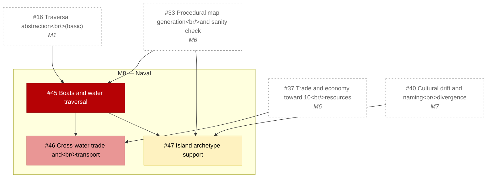

# M8 — Naval

_Generated by `tools/Build-Roadmap.ps1` from GitHub issues. Do not edit by hand; the commit date is the generation date._

Boats, cross-water trade, island archetype. Largest single feature; traversal abstraction must exist from M1. See §19.

[Milestone on GitHub](https://github.com/zhollis21/KingdomWatch/milestone/9) · [Roadmap](README.md)

| Issue | Title | Priority | Status | Blocked by | Blocks |
|---|---|---|---|---|---|
| [#45](https://github.com/zhollis21/KingdomWatch/issues/45) | Boats and water traversal | P0-blocker | blocked | [#16](https://github.com/zhollis21/KingdomWatch/issues/16), [#33](https://github.com/zhollis21/KingdomWatch/issues/33) | [#46](https://github.com/zhollis21/KingdomWatch/issues/46), [#47](https://github.com/zhollis21/KingdomWatch/issues/47) |
| [#46](https://github.com/zhollis21/KingdomWatch/issues/46) | Cross-water trade and transport | P1-high | blocked | [#37](https://github.com/zhollis21/KingdomWatch/issues/37), [#45](https://github.com/zhollis21/KingdomWatch/issues/45) | — |
| [#47](https://github.com/zhollis21/KingdomWatch/issues/47) | Island archetype support | P2-normal | blocked | [#33](https://github.com/zhollis21/KingdomWatch/issues/33), [#40](https://github.com/zhollis21/KingdomWatch/issues/40), [#45](https://github.com/zhollis21/KingdomWatch/issues/45) | — |
