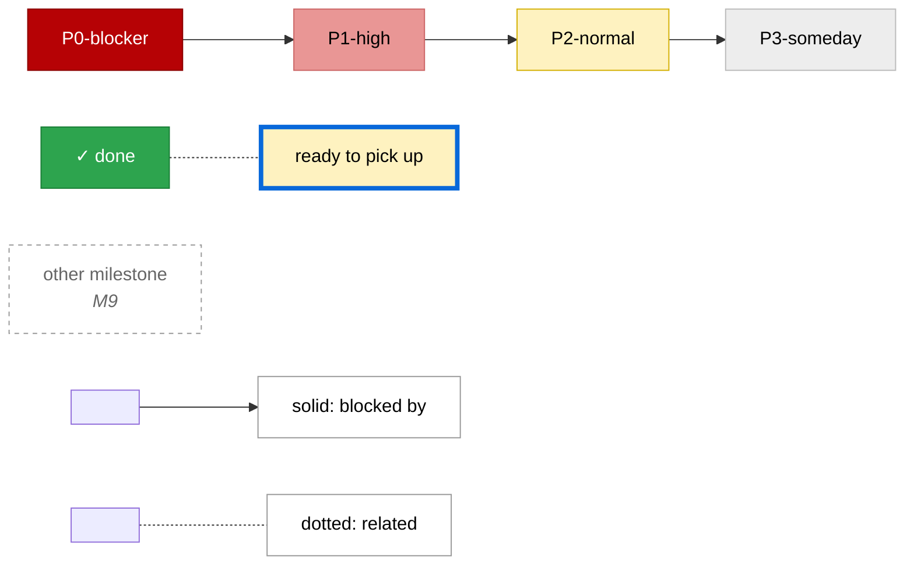

# Roadmap

_Generated by `tools/Build-Roadmap.ps1` from GitHub issues. Do not edit by hand; the commit date is the generation date._

Every issue, in its milestone, with what it waits on. Solid arrows are GitHub's native *blocked by* relationships; dotted lines are `Related: #N` lines in issue bodies. An open issue is **ready** when everything it is blocked by is closed. See [next.md](next.md) for the two milestones that matter right now, or a milestone page for the full chart.

## Ready to pick up

| Issue | Title | Milestone | Priority | Unblocks |
|---|---|---|---|---|
| [#13](https://github.com/zhollis21/KingdomWatch/issues/13) | WorldValidator and cross-platform determinism hash | M1 — Headless sim | P1-high | [#17](https://github.com/zhollis21/KingdomWatch/issues/17), [#33](https://github.com/zhollis21/KingdomWatch/issues/33) |
| [#16](https://github.com/zhollis21/KingdomWatch/issues/16) | Traversal abstraction (basic) | M1 — Headless sim | P1-high | [#23](https://github.com/zhollis21/KingdomWatch/issues/23), [#25](https://github.com/zhollis21/KingdomWatch/issues/25), [#27](https://github.com/zhollis21/KingdomWatch/issues/27), [#33](https://github.com/zhollis21/KingdomWatch/issues/33), [#35](https://github.com/zhollis21/KingdomWatch/issues/35), [#37](https://github.com/zhollis21/KingdomWatch/issues/37), [#45](https://github.com/zhollis21/KingdomWatch/issues/45), [#52](https://github.com/zhollis21/KingdomWatch/issues/52), [#54](https://github.com/zhollis21/KingdomWatch/issues/54) |
| [#57](https://github.com/zhollis21/KingdomWatch/issues/57) | Nothing detects RNG key collisions between different call sites | M1 — Headless sim | P1-high | — |
| [#15](https://github.com/zhollis21/KingdomWatch/issues/15) | Safe save snapshot semantics | M1 — Headless sim | P2-normal | [#19](https://github.com/zhollis21/KingdomWatch/issues/19), [#42](https://github.com/zhollis21/KingdomWatch/issues/42) |
| [#53](https://github.com/zhollis21/KingdomWatch/issues/53) | Seasons and the year cycle | M1 — Headless sim | P2-normal | [#17](https://github.com/zhollis21/KingdomWatch/issues/17), [#21](https://github.com/zhollis21/KingdomWatch/issues/21) |
| [#20](https://github.com/zhollis21/KingdomWatch/issues/20) | Go/no-go threshold for mobile | M2 — Stress test | P0-blocker | [#18](https://github.com/zhollis21/KingdomWatch/issues/18) |
| [#72](https://github.com/zhollis21/KingdomWatch/issues/72) | Core is not wired into the Unity project, so nothing can run the simulation on device | M2 — Stress test | P0-blocker | [#18](https://github.com/zhollis21/KingdomWatch/issues/18), [#73](https://github.com/zhollis21/KingdomWatch/issues/73) |
| [#31](https://github.com/zhollis21/KingdomWatch/issues/31) | Faith depth decision | M5 — Powers and faith | P0-blocker | [#30](https://github.com/zhollis21/KingdomWatch/issues/30) |
| [#41](https://github.com/zhollis21/KingdomWatch/issues/41) | Rumor propagation | M5 — Powers and faith | P2-normal | [#30](https://github.com/zhollis21/KingdomWatch/issues/30) |

## Milestones

```mermaid
flowchart LR
  MS0["M0 — Foundations<br/>3 done · 0 open"]:::done
  MS1["M1 — Headless sim<br/>13 done · 9 open"]:::p2
  MS0 --> MS1
  MS2["M2 — Stress test<br/>0 done · 6 open"]:::none
  MS1 --> MS2
  MS3["M3 — Living village<br/>0 done · 9 open"]:::none
  MS2 --> MS3
  MS4["M4 — Disruption<br/>0 done · 2 open"]:::none
  MS3 --> MS4
  MS5["M5 — Powers and faith<br/>0 done · 5 open"]:::none
  MS4 --> MS5
  MS6["M6 — Worldgen and dynamics<br/>0 done · 5 open"]:::none
  MS5 --> MS6
  MS7["M7 — Society and politics<br/>0 done · 6 open"]:::none
  MS6 --> MS7
  MS8["M8 — Naval<br/>0 done · 3 open"]:::none
  MS7 --> MS8
  classDef p0 fill:#b60205,color:#fff,stroke:#8c0000
  classDef p1 fill:#e99695,color:#000,stroke:#c66
  classDef p2 fill:#fef2c0,color:#000,stroke:#d4b106
  classDef p3 fill:#ededed,color:#000,stroke:#bbb
  classDef none fill:#fff,color:#000,stroke:#999
  classDef done fill:#2da44e,color:#fff,stroke:#1a7f37
  classDef ext fill:#fff,color:#666,stroke:#999,stroke-dasharray:4 4
  style MS1 stroke:#0969da,stroke-width:4px
```

| Milestone | Done | Open | Ready | Chart |
|---|---|---|---|---|
| [M0 — Foundations](https://github.com/zhollis21/KingdomWatch/milestone/1) | 3 | 0 | 0 | [M0.md](M0.md) |
| [M1 — Headless sim](https://github.com/zhollis21/KingdomWatch/milestone/2) | 13 | 9 | 5 | [M1.md](M1.md) |
| [M2 — Stress test](https://github.com/zhollis21/KingdomWatch/milestone/3) | 0 | 6 | 2 | [M2.md](M2.md) |
| [M3 — Living village](https://github.com/zhollis21/KingdomWatch/milestone/4) | 0 | 9 | 0 | [M3.md](M3.md) |
| [M4 — Disruption](https://github.com/zhollis21/KingdomWatch/milestone/5) | 0 | 2 | 0 | [M4.md](M4.md) |
| [M5 — Powers and faith](https://github.com/zhollis21/KingdomWatch/milestone/6) | 0 | 5 | 2 | [M5.md](M5.md) |
| [M6 — Worldgen and dynamics](https://github.com/zhollis21/KingdomWatch/milestone/7) | 0 | 5 | 0 | [M6.md](M6.md) |
| [M7 — Society and politics](https://github.com/zhollis21/KingdomWatch/milestone/8) | 0 | 6 | 0 | [M7.md](M7.md) |
| [M8 — Naval](https://github.com/zhollis21/KingdomWatch/milestone/9) | 0 | 3 | 0 | [M8.md](M8.md) |

## Legend

